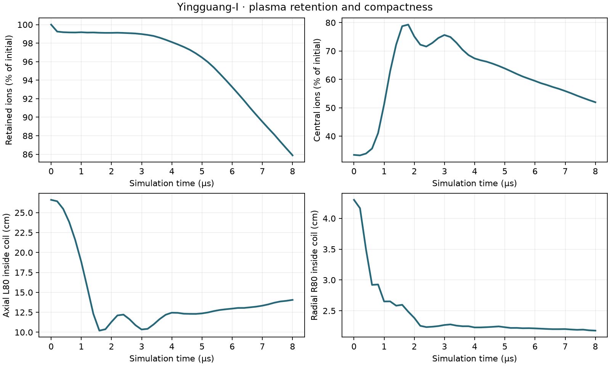
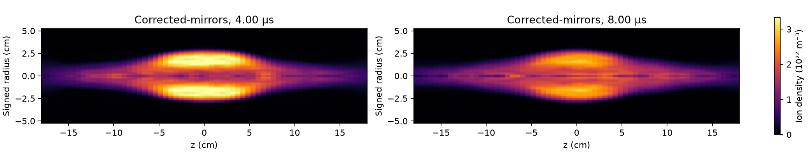
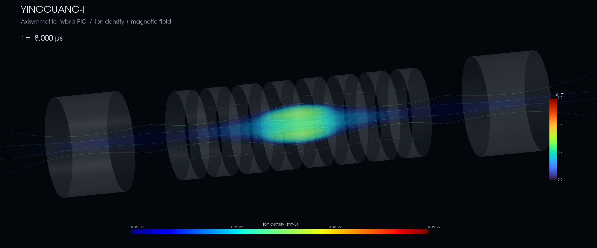

# Yingguang-I: hybrid-PIC plasma formation

An axisymmetric WarpX model of plasma formation in the Yingguang-I
theta-pinch device, with kinetic hydrogen ions and fluid electrons.

This repository presents one completed numerical case: **corrected mirror
polarity, cold localized plasma, and an early crowbar**. Its completed
48 × 176-cell simulation follows 8 µs of evolution.

## Corrected-mirror result

| Compactness and retention | Density evolution |
|:---:|:---:|
|  |  |

At the final output, the grid-based diagnostics give:

| Measurement | Corrected-mirror result |
|---|---:|
| Ions retained in the simulation domain | 85.9% of the initial inventory |
| Ions in the central 12 cm | 51.9% of the initial inventory |
| Axial L80 within the theta coil | 14.06 cm |
| Radial R80 within the theta coil | 2.18 cm |

L80 and R80 describe the ion inventory; they are not separatrix dimensions.
The result demonstrates compact plasma formation in this numerical model.
It does **not** establish numerical convergence, a stationary equilibrium,
or quantitative reproduction of the published experimental discharge.
The 96 × 352-cell higher-resolution repeat has been launched locally; no
completed higher-resolution result is claimed yet.

## Try the analysis without a GPU

Python 3.11 or later:

```bash
python -m venv .venv-analysis
source .venv-analysis/bin/activate
python -m pip install -e .

# Recreate the overview from the complete, small numerical table.
frc-report results/corrected-mirrors/compactness.csv --out results/local/overview.png

# Recompute measurements from four actual openPMD snapshots.
frc-compactness results/corrected-mirrors/sample --labels Corrected-mirrors --out results/local/sample

python -m unittest discover -s tests -v
```

The sample includes t = 0 and outputs near 2, 4, and 8 µs. It exercises the
real data reader and reproduces the endpoint measurements without a
simulation installation. The complete time series is included as CSV.

## Visualize the plasma

[](results/corrected-mirrors/evolution.mp4)

**[▶ Watch the 8 µs high-resolution visualization](results/corrected-mirrors/evolution.mp4)**
— 1920 × 800, 24 fps. The image above is also the video thumbnail.

[Open the interactive-viewer preview](results/corrected-mirrors/viewer.png) ·
[Viewer controls](docs/visualization.md)

```bash
python -m pip install -e '.[render]'
frc-view results/corrected-mirrors/sample --time-us 4

# When the full local data are available:
frc-view runs/corrected-mirrors --settings configs/render/presentation.json --quality interactive
```

Scrub time, rotate the camera, and tune density, transparency, smoothing,
field lines, and device geometry. Press **S** for a clean high-resolution image
or **W** to save the view. See the [viewer guide](docs/visualization.md) for
controls, reproducible presets, and smooth video export.

## Run the corrected-mirror configuration

[Install WarpX](docs/installation.md) before launching a simulation.
From the repository root, with the simulation environment activated:

```bash
frc-run --config configs/corrected-mirrors.toml --output runs/my-corrected-case --dry-run
frc-run --config configs/corrected-mirrors.toml --output runs/my-corrected-case
```

The launcher creates a new directory, saves the resolved parameters and
the exact Python source it executes, and records completion and output
checksums. It refuses an existing output directory.
Run one process on the GPU; do not launch this configuration with mpirun.

## Where to look

| Path | Purpose |
|---|---|
| [configs/](configs/README.md) | Corrected-mirror configurations and rendering presets |
| [src/yingguang_frc/model/](src/yingguang_frc/model/) | Device fields and WarpX simulation |
| [src/yingguang_frc/analysis/](src/yingguang_frc/analysis/) | openPMD readers and measurements |
| [src/yingguang_frc/visualization/](src/yingguang_frc/visualization/) | Figures, animation, and interactive viewing |
| [results/corrected-mirrors/](results/corrected-mirrors/README.md) | Corrected-mirror measurements, figures, sample data, and provenance |
| [docs/model.md](docs/model.md) | Equations, assumptions, geometry, and limitations |
| [docs/reproduction.md](docs/reproduction.md) | Commands to reproduce the analysis and run new cases |
| [docs/visualization.md](docs/visualization.md) | Interactive controls and high-quality image/video exports |
| [tests/](tests/) | Geometry, metadata, configuration, and result regression checks |
| [scripts/](scripts/) | WarpX build and corrected-case asset preparation |
| `runs/` | Local simulation outputs; excluded from version control |

[References](docs/references.md) · [Contributing](CONTRIBUTING.md) ·
[Citation metadata](CITATION.cff)

This is a public research repository. A code license has not yet been selected;
until one is added, copyright law reserves reuse rights to the author.
