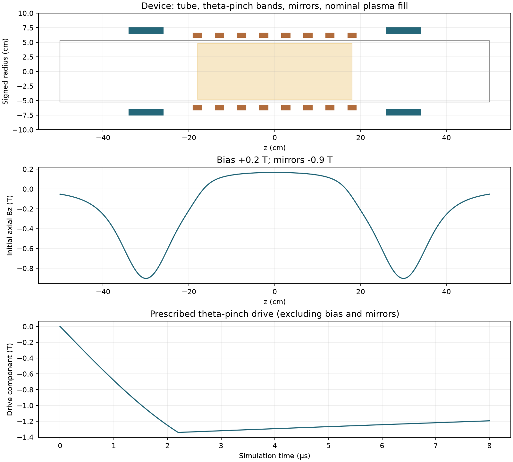

# Model and scope

The completed case follows 8 µs after the theta-pinch trigger. Hydrogen is already
ionized at t = 0. Ionization, neutrals, recycling, and external circuit
evolution are not simulated.

## Geometry and fields

The model uses cylindrical coordinates (r,z) with azimuthal mode m = 0.
The tube has inner radius 5.25 cm and length 1 m. The theta coil has radius
6.2 cm and length 36 cm. Mirror assemblies are centered at z = ±30 cm.

Each mirror is represented by three equivalent current loops, displaced by
−2.5, 0, and +2.5 cm from its center, at mean radius 7.9 cm. Their on-axis
contribution at each assembly's center is calibrated to −0.9 T.
The bias is +0.2 T. Thus the mirrors oppose the bias and align with the
negative main drive, as specified by Sun 2013 §2.3.

A smooth axial coil envelope is

`f(z) = [tanh((z + L/2)/w) − tanh((z − L/2)/w)] / 2`.

The initial field combines the analytic mirror fields with
`Bz = B_bias f(z)` and `Br = −r B_bias f'(z)/2`.
It is loaded through a Python callback, which is why a WarpX input dump alone
does not fully specify this model.

The main drive is applied through an external vector potential, so WarpX
derives its magnetic field and inductive electric field consistently.
Its amplitude parameter is 1.7 T, with quarter-period 3.8 µs. The completed case
crowbars at 2.2 µs, before the peak, then decays with a 50 µs time constant.
An eight-band axial ripple with coefficient 1.2 uses an asymptotic Bessel
approximation. The band count and ripple strength are modeling assumptions;
they are not a fitted experimental validation.

## Plasma and closure

| Quantity | Corrected-mirror case |
|---|---|
| Central initial ion density | 3.9 × 10²¹ m⁻³ |
| Initial ion/electron temperatures | 10 eV / 10 eV |
| Nominal plasma radius | 4.8 cm |
| Nominal axial fill | −18 to +18 cm |
| Radial/axial edge widths | 0.3 cm / 3 cm |
| Electron adiabatic index | 5/3 |
| Prescribed resistivity scale η₀ | 1.47 × 10⁻⁶ Ω m |
| Hyper-resistivity ηH | 3.5 × 10⁻¹⁰ Ω m³ |
| Density floor | 5% of the initial central density |

Ions are kinetic H⁺ particles; electrons are a massless adiabatic fluid.
The resistive closure is
`η(n) = min[η₀ n₀ / max(n, n_floor), 10 η₀]`.
η₀ is specified independently of electron temperature.
Both the resistive and hyper-resistive terms affect field evolution;
their influence requires sensitivity testing.

Initial density has smooth radial and axial sigmoid edges. Field boundaries
are Dirichlet at the outer radius and axial ends, with regularity at the
axis. Ions are absorbed at the wall and ends.

## Numerical configuration

The completed run has 48 × 176 cells, 20 macroparticles per cell, linear
particle shape, current filtering, and an adaptive RKF45 magnetic advance.
The ion step is `0.04 / ωci(1.9 T)`, approximately 0.220 ns.
Field outputs are about 200 ns apart; particle outputs are every ten field
diagnostic intervals. The final output is at 7.9998756 µs.

Initial divergence cleaning is disabled in this configuration.
The discrete divergence error and the effect of cleaning remain to be
evaluated for this geometry. Temperature deposition is disabled because a
heap-corruption problem was observed in the original RZ installation;
particle-based temperature analysis is available separately.

## What the result establishes

The completed case exhibits axial concentration and retains much of its
initial ion inventory over the simulated interval. The initial contraction
is followed by some reexpansion.

Axisymmetry permits azimuthal velocity and Bθ, but excludes nonaxisymmetric
density modes. Twisted magnetic field lines do not themselves demonstrate
rotation of plasma. The 3D images revolve an axisymmetric density field;
they are not results of a three-dimensional simulation.

No mesh/time-step/particle-number convergence claim is made. The planned
refinement has not been run to completion. The early crowbar, initialization,
and closure choices also prevent treating this case as a quantitative
reproduction of the published discharge.

See [diagnostic definitions](diagnostics.md) and [source references](references.md).
