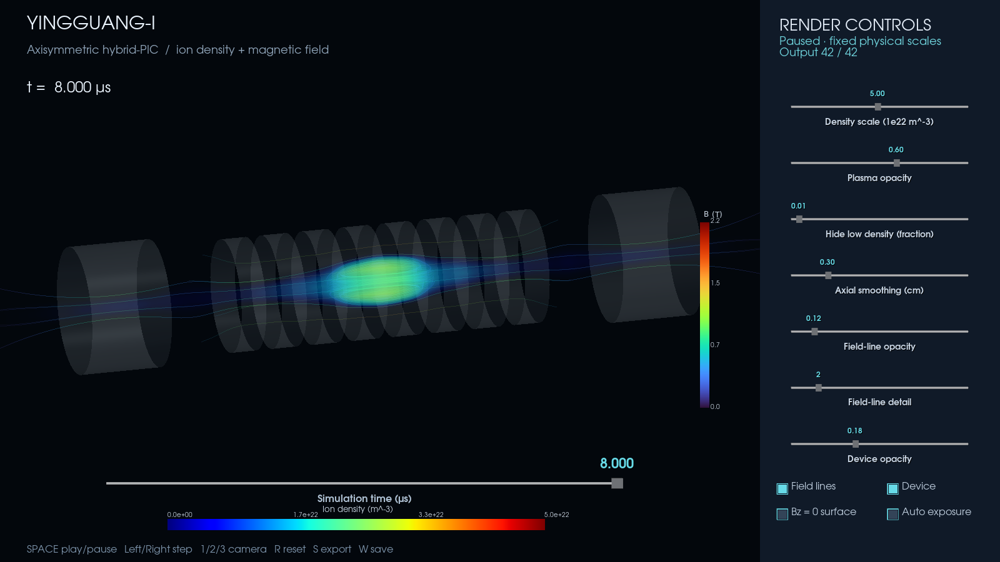

# Interactive visualization and publication exports

The viewer and exporter use the same scene, transfer function, camera, and
settings format. The presentation preset takes its framing, transparent device,
and softly rendered density from the supplied Hennigh comparison video. The displayed
fields remain those of this repository's **axisymmetric hybrid-PIC** model;
they are not a reconstruction of the comparison video's full-PIC plasma.



## Launch

Install the optional renderer into your analysis environment:

```bash
python -m pip install -e '.[render]'

# Works in a fresh checkout; four original diagnostic times.
frc-view results/corrected-mirrors/sample --time-us 4

# Complete local run, with the presentation preset and responsive preview grid.
frc-view runs/corrected-mirrors --settings configs/render/presentation.json --quality interactive
```

An interactive desktop and working VTK/OpenGL backend are required for the
window. The exporter also works headlessly with a suitable EGL/OSMesa backend.
On this workstation, use `.venv-analysis/bin/frc-view` and
`.venv-analysis/bin/frc-render` without activating the environment.

## Controls

Drag with the mouse to rotate; use the wheel to zoom. The bottom slider selects
the nearest recorded simulation time. Playback advances through recorded
outputs, wrapping at the end; `--fps 8` sets the target playback rate.
The actual rate depends on rendering cost.

The sidebar adjusts the density color scale, plasma opacity, low-density
cutoff, axial smoothing, field-line opacity/detail, and device opacity.
Checkboxes toggle field lines, device geometry, the axial-field-zero surface,
and automatic density exposure. Sliders update when released.

| Key | Action |
|---|---|
| Space or P | Play/pause |
| Left / Right | Previous/next diagnostic frame |
| 1 / 2 / 3 | Presentation / side / end camera |
| R | Reset the camera |
| W | Save current settings and camera to JSON |
| S | Export a clean 1920 × 800 high-quality PNG, settings, and metadata |

Exports go to `results/local/viewer/`, with unique timestamped names.
Use `--output-dir` to choose another directory. Image exports omit the control
panel and preserve the current framing. They pause playback while rendering.

Reload a saved view with `--settings path/to/view.settings.json`. JSON also
exposes radial smoothing, opacity gamma, colormaps, magnetic color scale, line
width, quality, and playback rate. Unknown keys and invalid values are rejected.
The density scale is in m⁻³, magnetic scale in tesla, and smoothing lengths in cm.

## Export images and smooth video

```bash
# A single frame (interpolated if the requested time falls between outputs).
frc-render runs/corrected-mirrors --settings configs/render/presentation.json \
  --time-us 4 --out results/local/frame-4us.png

# Eight seconds of playback covering the complete simulation; 192 frames.
frc-render runs/corrected-mirrors --settings configs/render/presentation.json \
  --duration 8 --fps 24 --size 1920 800 --out results/local/evolution.mp4

# Reproduce a tuned camera and appearance at high quality.
frc-render runs/corrected-mirrors --settings path/to/view.settings.json --quality high \
  --duration 8 --fps 24 --out results/local/tuned.mp4
```

Each export has a `.metadata.json` sidecar recording settings, camera, render
grid, physical times, software versions, and renderer-source hashes. Existing
images/videos are not overwritten. A saved settings file carries the selected
time for PNG exports; movie exports cover the entire available series.

Without `--duration`, videos contain one image per selected diagnostic output.
With `--duration`, the exporter linearly interpolates density and magnetic
components for smooth playback. This does not create new simulated data.
Use the complete run for movies: interpolation across the four bundled sample
frames cannot recover the intervening evolution. `--stride` subsamples the
inputs but always includes the final output.

## Quality and scientific interpretation

| Quality | Axial × diameter × diameter display samples | Intended use |
|---|---|---|
| `interactive` | 176 × 64 × 64 | Responsive exploration |
| `high` | 352 × 128 × 128 | Default standalone exports |
| `ultra` | 528 × 192 × 192 | Large exports; greater memory/rendering cost |

These are **rendering grids**, not simulation resolution. `--size` controls
image pixels separately. The processed-frame cache is bounded to four frames
and approximately 192 MiB, excluding the active VTK grid and original fields.
Only small RZ source arrays are loaded for the complete series.

Fixed physical color scales are the default, including in the presentation
preset. Opt-in auto exposure changes the density scale between frames and is
explicitly labeled; it is unsuitable for judging density change by brightness
alone. The density and magnetic field have separate colorbars.

Smoothing, opacity, cutoff, interpolation, and field-line seed density affect
appearance, never the stored fields or compactness measurements. `Bz = 0` is
an axial-field-zero surface, **not a separatrix**. A 3D rendering of revolved
RZ fields does not demonstrate nonaxisymmetric structure or 3D stability.

MSAA is used for geometry antialiasing: VTK's SSAA pass was found to omit
volumes on the tested headless backend. Pixel tests check that density is
actually visible, in addition to testing widget callbacks, playback, saved
cameras, and source-data preservation. Run all available tests with:

```bash
python -m unittest discover -s tests -v
```

If the renderer is slow, select `--quality interactive`, hide field lines, or
reduce field-line detail. Export at high quality after tuning. For a headless
UI check, `frc-view results/corrected-mirrors/sample --off-screen` saves the full panel
to PNG and exits. This is a smoke test, not an interactive window.
